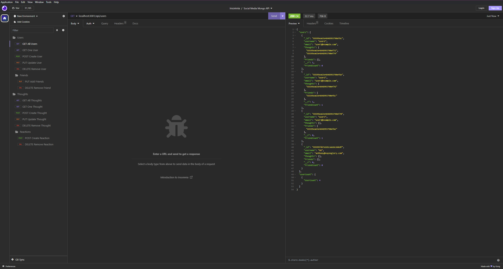

# CWRU Bootcamp Challenge 16 - MongoDB Social Media API

    
## Description
    
### The goal of this project was to create an API for a basic Social Media Website using GET, POST, PUT and DELETE API calls supported by a NOSQL database, MongoDB!
### Behind the scenes, this program heavily relies on MongoDB, which for the end user making the calls, not much changes. But, for the program behind, the syntax changes heavily for specific MongoDB functionality, yet Express is used much the same way to provide the end user with working routes.

## Table of Contents

- [Installation](#installation)
- [Usage](#usage)
- [Video](#video)
- [Mockup](#mockup)
- [Contributing](#contributing)
- [License](#license)
- [Contact Me](#questions)

## Installation

1. Simply download the files, run 'npm install' to get the required packages! 
2. Afterwards, feel free to use the test seed provided by running 'npm run seed'. 

## Usage

Once all of those steps have been taken, you should be good to start the server with 'npm start'!

## Video

### Here is a link to the video example showcasing the installation and usage of this project:

## Mockup

     
    An example display of a GET call of 'users' using Insomnia!

## Contributing

Feel free to fork this repo if you have anything you want to add, change, or remove in regards to this project. I love feedback!

## License

The license used in this project was the MIT license! Please reference the LICENSE file inside of the repository.

## Questions?

You can find me here on GitHub at https://www.github.com/Anthony-GG

Otherwise, feel free to reach me at anthony@vayneglory.com

---